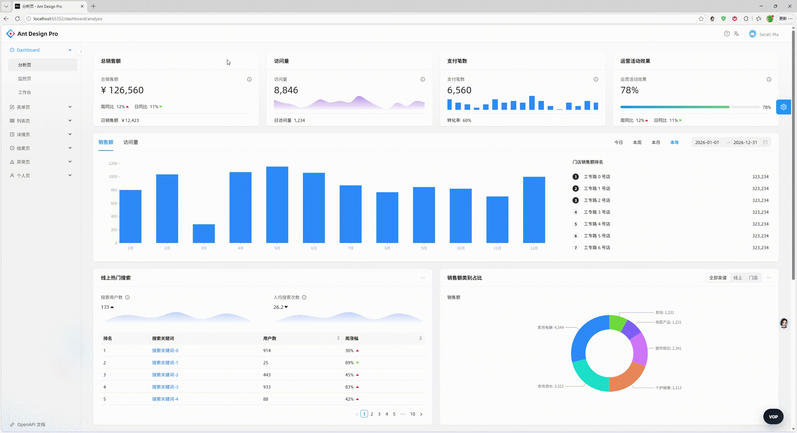

# VOP  (Visible Operations Protocol)

面向真实 Web 应用的路由感知 AI 执行协议。

[English README](./README.md) · [Docs](./docs/README.md) · [中文文档](./docs/README.zh-CN.md) · [案例](https://github.com/futelab/vop-examples) 

[](./docs/assets/images/example-antd.gif)

点击封面图查看完整演示 GIF。

## AI 驱动页面执行是如何工作的

VOP 通过一个很小的 planner API 和页面感知 runtime，把 OpenAI-compatible 模型接到真实业务页面上：

1. 你的应用在 `vop.config.ts` 里声明路由、表单、表格和 assistant 元数据。
2. 宿主应用把用户意图发送到 planner 接口，由一个 OpenAI-compatible 的 `/chat/completions` 模型生成结构化任务计划。
3. VOP 把这个计划映射到当前页面，在 runtime 中执行支持的动作，并对高风险操作保留确认关口。
4. assistant UI 会持续挂载在应用里，让模型能够导航页面、填写表单、读取可见状态，并完成面向用户的工作流。

## VOP 提供什么

- 配置归一化
- planner helper
- runtime 执行
- 高风险动作确认流
- React assistant UI 导出
- runtime 文件生成 CLI

当前支持的页面形态：

- `shell`
- `form`
- `table`

## 安装

```bash
npm install @futelab/vop
```

## 导入

```ts
import { defineVopConfig } from "@futelab/vop/sdk";
import type { VOPAppManifest } from "@futelab/vop/protocol";
import { VOPRuntime } from "@futelab/vop/runtime";
import { VopAssistant } from "@futelab/vop/panel/react";
```

- `defineVopConfig` 用来编写 `vop.config.ts`
- `VOPRuntime` 是宿主应用里使用的 runtime 控制器
- `VopAssistant` 是可直接接入的 React assistant UI
- `VOPAppManifest` 以及其他 protocol 类型适合在宿主集成时做类型约束

## `vop.config.ts` 示例

```ts
import { defineVopConfig } from "@futelab/vop/sdk";

export default defineVopConfig({
  planner: {
    baseURL: "/api/vop-planner",
    model: "Qwen/Qwen3.5-397B-A17B-FP8",
    title: "VOP Copilot",
  },
  pages: [
    {
      route: "/dashboard/analytics",
      title: "Dashboard Analytics",
      group: "Dashboard",
    },
    {
      route: "/demos/form",
      title: "Form Demo",
      kind: "form",
      rootSelector: "#app",
      formSelector: "form",
      submitButtonSelector: 'button[type="submit"]',
      fields: {
        title: {
          kind: "text",
          selector: 'input[name="title"]',
          label: "Title",
          required: true,
        },
      },
    },
  ],
});
```

CLI 会读取这个文件，并生成应用运行时要用到的数据。

## 生成 runtime 文件

```bash
bunx @futelab/vop generate --config ./vop.config.ts
```

这条命令会生成一个把配置接到 runtime 上的文件，通常类似 `src/vop.generated.ts`。

## 在宿主应用里接入

下面这个写法参考了 `ant-design-pro` 示例：

```ts
import React from "react";
import {
  createConfiguredAssistantBindings,
  VopAssistant,
  VopHighlight,
} from "@futelab/vop/sdk";
import vopConfig from "../vop.config";
import { getCurrentVopPageId, getVopRuntime } from "./vop.generated";

const vopBindings = createConfiguredAssistantBindings(
  vopConfig,
  getVopRuntime(),
  getCurrentVopPageId,
);

export function AppShell() {
  return (
    <>
      <YourAppRoutes />
      <VopAssistant {...vopBindings} />
      <VopHighlight runtime={getVopRuntime()} />
    </>
  );
}
```

这段代码里：

- `getVopRuntime()` 返回共享的 `VOPRuntime` 实例
- `createConfiguredAssistantBindings(...)` 把配置、runtime 和当前页面查找函数连起来
- `VopAssistant` 负责渲染 assistant UI
- `VopHighlight` 负责渲染 runtime 的高亮层

## `VOPRuntime` 和 `VOPAppManifest`

如果你使用 `vop.config.ts` 和生成文件，一般不需要手写这两个对象；但在宿主侧需要更细的控制时，它们也可以直接使用。

```ts
import { VOPRuntime } from "@futelab/vop/runtime";
import type { VOPAppManifest } from "@futelab/vop/protocol";

const runtime = new VOPRuntime();

const manifest: VOPAppManifest = {
  appId: "demo-app",
  version: "1.0.0",
  pages: [{ pageId: "dashboard", title: "Dashboard", route: "/dashboard" }],
  navigation: [],
};

runtime.registerAppManifest(manifest);
```

## 仓库内容

- `packages/vop` — 对外发布的包
- `docs` — 项目文档

示例应用放在仓库外部维护。

## 文档

仓库文档位于 `docs/`：

- `docs/getting-started.zh-CN.md`
- `docs/authoring.zh-CN.md`
- `docs/runtime.zh-CN.md`
- `docs/sdk-boundary.zh-CN.md`
- `docs/packaging.zh-CN.md`
